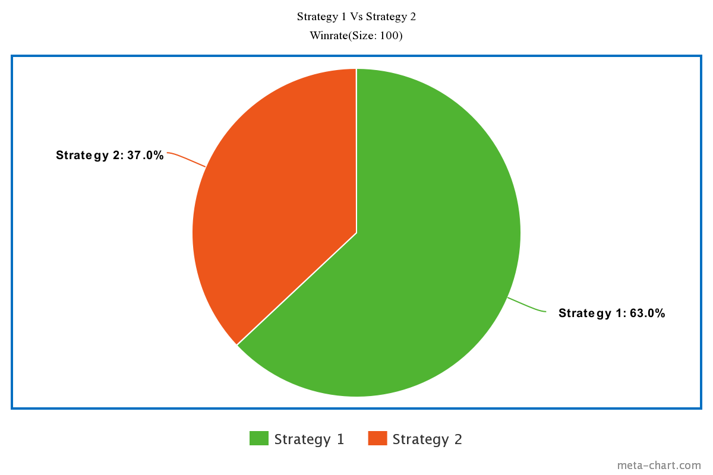
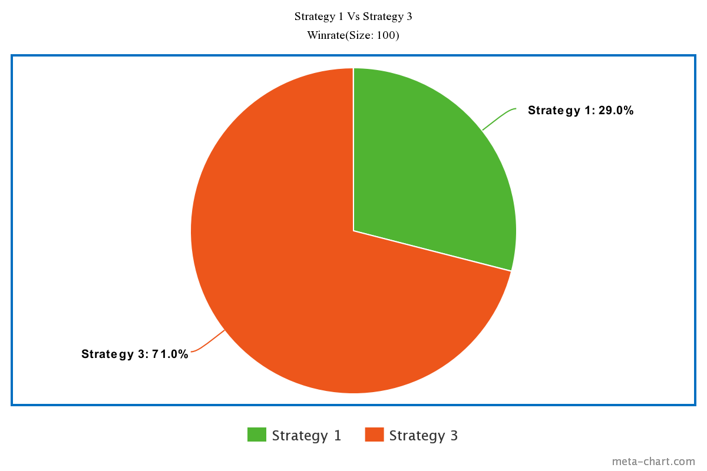

# 2023F CS2910 Project Report
**Group Members**
1. Abhai Renjith (0352983)
2. Yogish Dumur (0358218)

# Summary of Game
The chosen game is "Battleship." The goal of the game is to strategically deploy a fleet of ships on a grid and take turns guessing the coordinates of the opponent's ships to sink them. 
Key objects include aircraft carriers, battleships, cruisers, destroyers, and submarines, each occupying different grid spaces. The game requires deduction and tactical thinking to outmaneuver the opponent. 
Here is the set of rules that can be found on the official website (https://www.hasbro.com/common/instruct/battleship.pdf).
# Experiment Report
## Player Strategies
_For each of 3 strategies you implemented, name the strategy, and then description of it (100 words each)_
1. Strategy 1: Random Placement;
   In this strategy, ships are placed randomly on the game board. This approach introduces an element of unpredictability, making it harder for opponents to anticipate the ship locations. While it lacks a structured formation, the randomness can create challenges for the opponent's targeting strategy.
2. Strategy 2: Connecting Ships;
   This strategy involves placing ships in a manner that connects them, forming larger ship structures. By linking ships together, it adds a layer of complexity to the opponent's task, as hitting one part of a connected ship may reveal the presence of an even larger vessel. This method aims to confuse and mislead opponents by presenting unconventional ship configurations.
3. Strategy 3: Even Distribution;
   The even distribution strategy focuses on spreading ships uniformly across the board. This approach minimizes the chances of concentrated hits in one area, making it difficult for the opponent to rapidly locate and sink multiple ships. By evenly dispersing the fleet, this strategy aims to maintain a defensive balance, requiring opponents to explore the entire grid systematically, which can be time-consuming and strategic.

## Procedure
The experiment was designed to assess the effectiveness of three different player strategies in the game of Battleship. Three distinct loops were implemented to compare each strategy against the others.

The first loop involved pitting Strategy 1 (Random Placement) against Strategy 2 (Connecting Ships) across 100 trials. Each trial involved running the game with these strategies to evaluate which strategy resulted in more victories. The second loop focused on Strategy 1 versus Strategy 3 (Even Distribution), and similarly, the third loop compared Strategy 2 against Strategy 3. The goal was to observe and analyze the outcomes to determine the relative success rates of the different strategies.

For each trial, the chosen strategies were implemented, and the game was allowed to run until one player achieved victory by sinking all the opponent's ships. The experiment aimed to provide insights into which strategy was more effective in terms of winning matches over multiple iterations.

The primary data collected during the experiment was the number of wins for each strategy in the respective matchups. This data allowed for a quantitative comparison of the success rates of the strategies against each other. The experiment was structured to provide a comprehensive understanding of the relative performance of the three strategies, shedding light on their strengths and weaknesses in different matchups. The use of 100 trials per comparison helped ensure statistical robustness and reliability in drawing conclusions about the strategies' comparative effectiveness.

## Results
After conducting a series of simulations to evaluate the performance of three different player strategies in the game of Battleship, we observed intriguing results. The strategies were tested in pairs across 100 trials each, and the data reveals distinctive patterns in their effectiveness.

Strategy 3 emerged as the most effective, showcasing a consistent win rate of nearly 70% against both Strategy 1 and Strategy 2. This suggests that the even distribution of ships across the board provides a strategic advantage, making it challenging for opponents to locate and sink the fleet.

While Strategy 1 had a moderate success rate against Strategy 2, it struggled against the more structured Strategy 3. The randomness introduced in ship placement proved to be effective in some scenarios but lacked the consistency demonstrated by Strategy 3.

Strategy 2 displayed the least effectiveness in the simulations, achieving roughly equal success rates against Strategy 1 and Strategy 3. The attempt to create larger ship structures by connecting them did not consistently outperform the other strategies.

**Example Image:**

**Example Table:**

| Strategies (x Vs y) | Winrate (x) | Winrate (y) |
|---------------------|-------------|-------------|
| 1 Vs 2              | 63          | 37          |
| 1 Vs 3              | 29          | 71          |
| 2 Vs 3              | 32          | 68          |

## Analysis
Based on the results of our experiment, the most successful strategy for playing Battleship was Strategy 3 (Even Distribution). This superiority can be attributed to our firing mechanism's characteristics, which were crucial in determining how the simulations turned out.

In our implementation, when a hit was detected, the firing class targeted neighboring coordinates. This design decision greatly benefited Strategy 3. Uniform distribution of ships made it difficult for the firing class to effectively branch out and find other ships. Due of the opponent's inability to quickly locate and destroy the whole fleet, Strategy 3 had a greater win rate.

In contrast, because of the features of the firing mechanism, Strategy 2 (Connecting Ships) performed less well. By connecting ships, the fire class was able to launch chain attacks more readily, which may result in the simultaneous destruction of several connected ships. Although in some situations this interconnection gave the fleet a tactical edge, in the end it rendered the fleet more susceptible to successive strikes, which resulted in a lower win rate than with Strategy 3.

The first strategy, random placement, showed an average success rate that was in the middle of the other two options. A component of both even distribution and connected ships was introduced by the unpredictability of the random ship placement. Strategy 1 matched the features of Strategy 2, permitting consecutive hits in instances where ships were positioned very near to one another. On the other hand, if ships were dispersed at random, it mirrored Strategy 3's even distribution. The moderate success of Strategy 1 was a result of this approach's duality, which demonstrated adaptability in many contexts.

The triumph of Strategy 3 highlights how crucial strategic positioning is in Battleship. This tactic successfully addressed the firing class's tendency to hit nearby coordinates after hitting a ship by dispersing ships equally. This offered a strong defensive mechanism and prevented the opponent from using a series of hits in sequence.

These revelations highlight the complex interaction among firing class design, ship placement tactics, and overall gameplay dynamics. The experiment highlights the necessity of a well-designed firing mechanism that is in line with the selected strategy in addition to highlighting the efficacy of even distribution. The results provide useful suggestions for improving the strategic depth and balance of Battleship games by refining both ship placement methods and firing algorithms.

# Reflection
_A reflection on your experiences with generative AI during this project. Provide a few sentences reflecting
on your experience with AI for each of the following prompts._ 

### What generative AI did you use, and what tasks did you use it for?
A generative AI that we used in this project was Chat-gpt, it helped us go through many lines of code to find where we put a 0 instead of an O causing the code to break. It would have been extremely tedious to go through it manually
but chat showed the general area of the code and told us what was wrong with it. We also used it to check if the structure of our code made sense and would work properly.

### Reflecting on your experience:
_Write a short reflection on your use of generative AI in this project, including if you did not use it. 
You may use the prompts as headings if you wish. (500 words)_  

**Prompts to think about in writing your reflections if you worked with generative AI:**
- What went well using generative AI in this project?

What went well with using AI in this project is that it made it much easier to debug code, check if there were any mis inputted characters and 
checked if our logic made sense. It also helped brainstorm what should be included in a battleship game. Generative AI was also helpful in constructing 
complex test cases when it came down to sophisticated methods.
- What went well using generative AI?

Generative AI made it easier to understand what some of the segments in the report expected of us as I found some sections unclear.
Generative AI played a crucial role in generating unbiased and diverse test cases for the code, greatly increasing our experimentation's 
robustness. The generative AI made sure that our test cases covered a broad variety of potential inputs and scenarios by utilizing its 
capacity to mimic different patterns and scenarios. Potential edge cases and vulnerabilities that might not have been obvious through manual 
test case generation alone were found with this approach. 

Through the creation of objective and varied test situations, generative AI enhanced 
the thoroughness of our evaluation of our code's functionality, enabling us to pinpoint advantages and disadvantages for various Battleship game 
strategies. In addition to saving time, this automated and methodical testing approach offered a more thorough and objective assessment, which 
eventually resulted in a more dependable and resilient implementation of our initiatives.
- What didn’t go well using generative AI?

Sometimes, the examples and debugging help it gave us was completely wrong causing us to have to rollback to earlier versions of the project making us lose a bit of progress.
- Were there any limitations you encountered using generative AI?

A limitation in my opinions is that AI thinks too one dimensionally. It gets hung up on the first decision it makes and even when we try to correct it, it says Sorry but gives the same solution so it was quite frustrating.
Therefore, it is not good to trust everything that the AI says.
- How did your solution change/evolve/improve/degrade because of the generative AI?

As I previously it helped debug and give suggestions to our code, so it definitely improved our solution quite a bit, but, not everything it said was correct, so we had to choose the advice it gave wisely.
Most of the suggestions it gave were not implemented except for things like iterating conditions as it was quite hard to understand when do use && or || in our situation.
- What could you have done so the project turned out better?

The project could have been better if we implemented a smart search algorithm to look out for the best ship placements. 
We could also have implemented a different firing strategy in addition ship placing strategies for each strategy to introduce more variety and maybe would have made the testing of the strategies more fair. 
However, I think that our implementation of the firing class is more like how a human would play so in that aspect I think it's pretty alright.

# Bonus Consideration:

The reflection on the usage of generative AI.